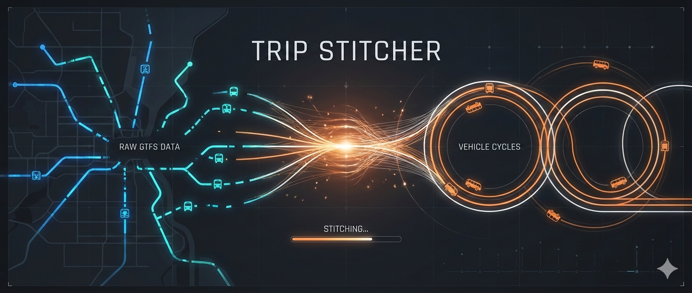

# Trip Stitcher



**⚠️ Disclaimer:** This repository is a work in progress. Its purpose and implementations are still evolving, and changes may occur frequently.

## Installation

This installation assumes the use of *venv*.

**1. Clone the repository:**

```
git clone git@github.com:pinti-zh/trip-stitcher.git
cd trip-stitcher
```

**2. Create a virtual environment:**

Linux/macOS:
```
python3 -m venv venv
source venv/bin/activate
```

Windows (Powershell):
```
python -m venv venv
.\venv\Scripts\Activate.ps1
```

**3. Upgrade pip:**

```
pip install --upgrade pip
```

**4. Install ocsept:**

```
pip install git+https://gitlab.com/ocsept/ocsept.git@develop
```

**5. Install dependencies:**

```
pip install -r requirements.txt
```

## Usage

**1. Activate the virtual environment**

Linux/macOS:
```
source venv/bin/activate
```
Windows (Powershell):
```
.\venv\Scripts\Activate.ps1
```

**2. Read the GTFS data into a database:**

This step assumes that you have a directory containing
all the .txt files of the GTFS dataset.

```
python db_creation.py --gtfs-directory <your-gtfs-directory> 
```

This can take a few minutes.

After successful execution of the script the data is stored in a database for faster access.

**3. Extract relevant information into a parquet file:**

Chose a destination for the relevant data, for example `data/postauto.parquet`.

```
python build_postauto_dataset.py --query-output-file <your-destination>
```

**4. Extract trips and estimate energy demands:**

To extract the trips and calculate the energy demands we use three scripts:
1. `trips.py`: Extracts trips from a .parquet file.
2. `osrm.py`: Augments trips with routing and elevation data.
3. `energy_demand.py`: Estimates energy demands of the trips. 

All scripts output structured JSON Lines to stdout and log to stderr. This means you can specify output files or pipe the scripts to one another, and combine them with Unix commands. For example, you can run:

```
python trips.py --file data/postauto.parquet | head -n 8| python osrm.py | python energy_demand.py --bus-type mini > output/energy_demands.jsonl
```

This will estimate the energy demand of the first 8 trips extracted from `data/postauto.parquet`.

**Warning:** Since `osrm.py` is using public APIs, an internet connection is required to run the script.
